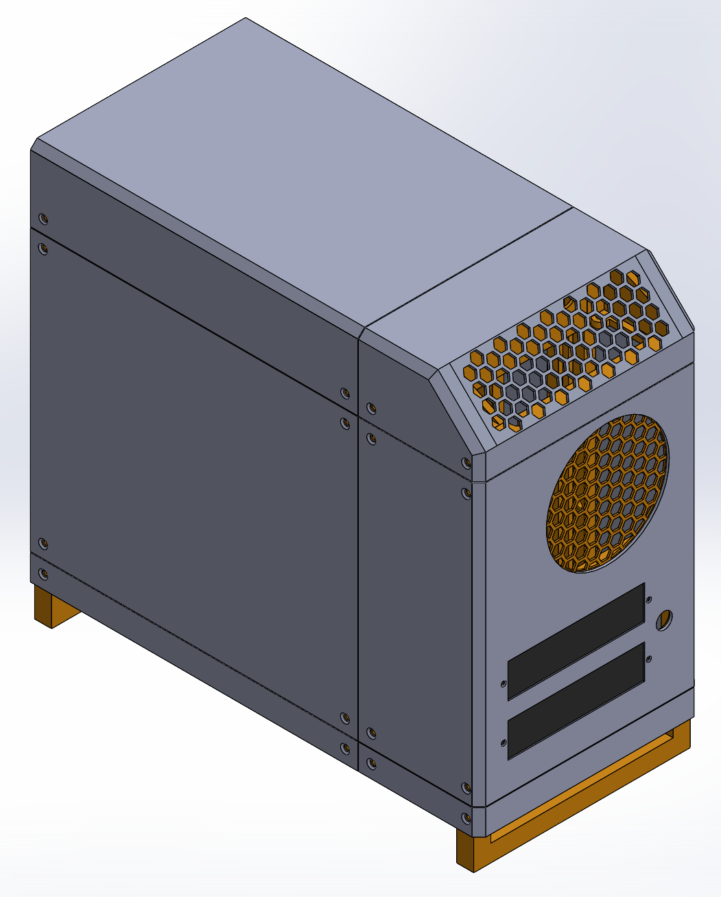

# 3D Printed Micro ATX PC Case (SFX PSU)
 
<!-- TODO: Add a hero photo of the finished case here, e.g.  -->

 
## Introduction
 
This project is a custom-designed, 3D printed PC enclosure built to serve as the foundation for future robotics projects, starting with a robotic arm integrated directly into its lid. The design fits a Micro ATX motherboard, an SFX power supply, and a full-size RTX 4060 graphics card. The front of the PC will have programmable status screens to display temperatures, processor loads, or whatever else you might want.
 
This project remains a work in progress. While I have begun printing and assembling my own case, there are some notable issues in the physical assembly process that I intend to address. A full list of concerns can be found in the [Roadmap](#roadmap) below.
 
### Design Features:
 
- Support for Micro ATX motherboard and SFX power supply
- 13.0" x 6.4" footprint
- 16.3 liter volume
- 2x 120mm intake fans
- 1x 80mm exhaust fan
- Designed to print without supports
- Designed for PETG

### Compatibility:
 
| Component | Limit |
| --- | --- |
| Motherboard | Micro ATX |
| Power supply | SFX |
| GPU | Full-size RTX 4060 (max length: `TBD` mm, max thickness: `TBD` mm) |
| CPU cooler | Max height: `TBD` mm |
| Printer bed | 250 x 210 x 220 mm or larger (designed on a Prusa MK4S) |

## Design Considerations
 
The files in this repository include drawings used as references for the CAD dimensions (`3D_PC_SFX/docs`). I have found these to be accurate for this project. If you wish to personalize or customize the files, I highly recommend referencing these drawings to ensure components will fit.
### Airflow and Cable Management
 
This case has been designed with airflow and cable management in mind, a common challenge in small form factor builds. It sits raised, with 120mm intake fans in the bottom of the case pulling in cool air that feeds the GPU directly. The single 80mm exhaust works to remove heat blown through the GPU cooler. This creates positive pressure inside the case, which uses the gaps in the 3D printed panels to its advantage to boost heat removal.
 
The PSU sits isolated at the front of the case, with its intake on the front and its exhaust out of the top. This positioning also leaves a large, open space underneath the GPU for cable management.
 
### Printing and Assembly
 
The assembly was designed in SolidWorks to be printed on my Prusa MK4S (250 x 210 x 220 mm bed size). The project was also designed to be printed without supports to save filament and print time.
 
The internal frame can be assembled with 3D printed pins. Depending on the tolerance of your printer, it is recommended that you adjust these pins and do a fit check first (`3D_PC_SFX/CAD/pins`). The outer panels are attached with screws threaded into heat-set inserts in the PC frame.
 
### Material
 
PC components are thermal components, so PETG is recommended for this build. It tolerates heat better than PLA, which can soften near warm components. Print and build at your own risk if you use other materials.

## Roadmap
 
- [ ] Create a BOM for necessary hardware
- [ ] Add STEP exports and printable files (STL/3MF) to the repository
### Finish the CAD
 
- [ ] Test print all components (67% complete)
### Design status screens
 
- [ ] Decide what should actually be displayed
- [ ] Design screen mounts for the front panel
- [ ] Consider designing a PCB for the front screens
- [ ] Debug the serial connection
- [ ] Write code to read system temperatures and loads and send them to the screens

## License
 
The design files in this repository are licensed under [CC BY-NC 4.0](https://creativecommons.org/licenses/by-nc/4.0/). You're welcome to remix, modify, and build on this design for personal projects. Please credit "Jack Saussy" and link back to this repository. Commercial use, including selling files or printed copies, is not permitted.
